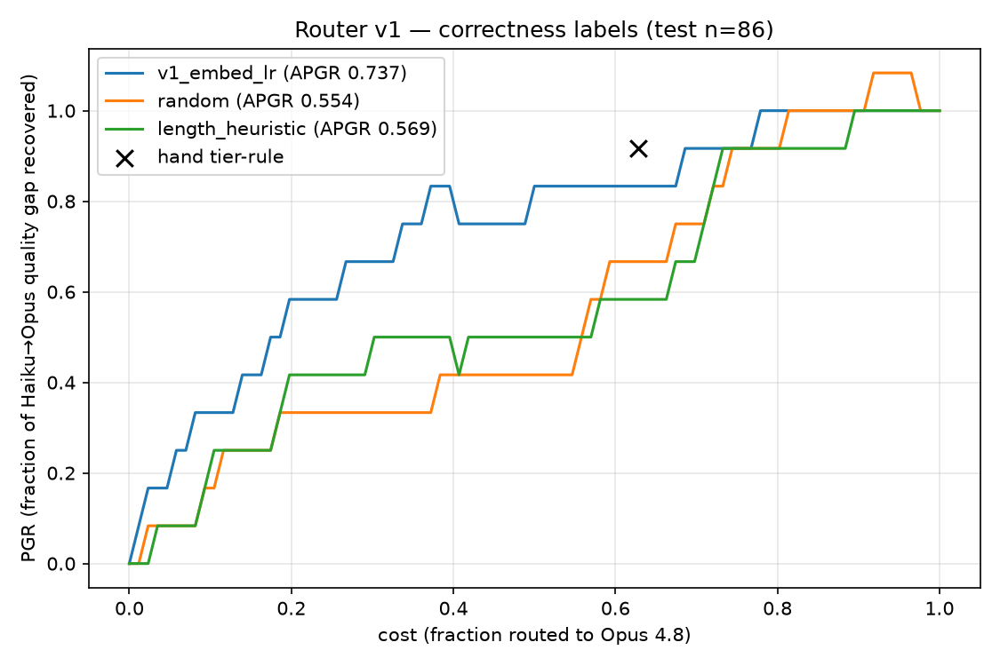

# tiered-model-router

Training a small router that predicts, per query, whether a cheap LLM can handle it or it needs an expensive one — then routing accordingly. Goal: frontier-quality answers at a fraction of the cost, with calibration and cost/quality tradeoff curves to prove it (or honest curves showing where it fails).

**Status: work in progress.** v0 (preference labels) failed honestly; v1 (correctness labels, live 2026 models: **Claude Haiku 4.5 vs Claude Opus 4.8**) works: same architecture, AUC 0.51 → 0.71, APGR 0.74 vs 0.55 random. Every number in this README comes from a run in this repo — no invented metrics. Total API spend so far: **$5.32**.

## Formulation

RouteLLM-style binary win-rate prediction ([Ong et al., ICLR 2025](https://arxiv.org/abs/2406.18665)): learn `P(strong model wins | query)` from preference data, route to the weak model when the predicted win probability is below a threshold. Sweeping the threshold traces the whole cost/quality curve from one trained model. Full design-space research (RouteLLM, RouterBench, FrugalGPT/AutoMix cascades, Not Diamond, Weave/Avengers-Pro) with links: [docs/phase1-research.md](docs/phase1-research.md).

## Data

[lmarena-ai/arena-human-preference-55k](https://huggingface.co/datasets/lmarena-ai/arena-human-preference-55k): 57,477 raw battles over 64 models. We fit Bradley-Terry scores on all decisive battles, cluster models into 10 tiers (1-D k-means over BT scores), take tiers 0–1 as the strong class and tier 2 as weak, and keep decisive cross-class battles:

| pipeline stage | count |
|---|---|
| raw battles | 57,477 |
| ties (dropped) | 17,761 |
| decisive cross-class battles kept | 7,849 (13.7% of raw) |
| train / val / test | 6,279 / 785 / 785 |
| P(strong side wins) | 0.656 |

That last number is why routing is possible at all: the strong class only beats the weak class about 2 in 3 times, so roughly a third of queries don't need the expensive model.

## v0: frozen embeddings + logistic regression — an honest negative result

v0 encodes prompts with `all-MiniLM-L6-v2` and fits a class-weighted logistic regression. **It learns almost nothing** (val AUC 0.506). Test-split routing metrics (APGR = area under the PGR/cost curve; higher is better, random ≈ 0.5 by construction):

| router | APGR | CPT@50% | CPT@80% | ECE |
|---|---|---|---|---|
| v0 embed+LR | 0.553 | 0.41 | 0.74 | 0.154 |
| random | 0.548 | 0.44 | 0.77 | — |
| prompt-length heuristic | 0.530 | 0.52 | 0.74 | — |

Diagnosis (`scripts/diagnose_v0.py`, all reproducible):

- Probe tasks on the same embeddings (predict has-code / prompt-length) hit **AUC 0.93** → pipeline and features are fine.
- Train AUC on real labels (0.652) ≈ train AUC on shuffled labels (0.625) → the fit is mostly memorization.
- 5-fold CV AUC 0.529 ± 0.013 vs 0.489 shuffled → a real but tiny signal.
- Restricting to a clean fixed pair (GPT-4-family vs Mixtral/GPT-3.5/Llama-70b) doesn't rescue it: CV AUC 0.517 on 1,682 battles.

**Conclusion: a single human vote on a single stochastic generation is a very noisy label.** Prompt-only difficulty signal exists in raw Arena preferences but is too weak for embeddings+LR at this scale. This reproduces, from the ground up, why RouteLLM's strong results depended on data augmentation with verifiable ("golden") labels rather than raw preferences alone.

## v1: correctness labels on live 2026 models — it works

v0's diagnosis said the labels were the problem, not the model. v1 keeps the architecture **byte-for-byte identical** (MiniLM embeddings + class-weighted logistic regression) and changes only the training signal: instead of noisy human preference votes, we ran verifiable prompts through **Claude Haiku 4.5** ($1/$5 per Mtok) and **Claude Opus 4.8** ($5/$25) via the Anthropic API, graded answers deterministically, and trained the router to predict `P(Haiku answers correctly | prompt)`.

### Finding the capability gap first (120-prompt probe, $1.06)

2026 models have saturated the classic benchmarks — both models went 10/10 on our GSM8K/MMLU smoke test. A stratified probe located where the Haiku→Opus boundary actually lives:

| tier | Haiku 4.5 | Opus 4.8 | needs-strong rate |
|---|---|---|---|
| GSM8K | 100% | 100% | 0% |
| MMLU | 90% | 95% | 5% |
| MATH L3 | 95% | 100% | 5% |
| MATH L4 | 65% | 80% | 15% |
| MATH L5 | 55% | 65% | 20% |
| MMLU-Pro | 65% | 80% | 15% |

The main labeling run (450 prompts, $4.21) weighted the mix toward the gap band while keeping easy anchors — a router also has to learn what "cheap suffices" looks like, and that's where the savings come from.

### Results (570 labeled prompts; 399/85/86 train/val/test)

Label quality transformed the same model:

| | v0 (Arena preference votes) | v1 (correctness labels) |
|---|---|---|
| val AUC | 0.506 (chance) | **0.710** |
| test APGR | 0.553 (random = 0.548) | **0.737** (random = 0.554) |

Test-split routing table (quality = fraction of prompts the routed model answered correctly; dollars = measured per-prompt spend from our runs):

| policy | % to Opus | quality | $/prompt | vs always-Opus |
|---|---|---|---|---|
| always Haiku | 0% | 0.744 | $0.0026 | −58% cost, −14pt quality |
| **router @ CPT50** | 17% | 0.814 | $0.0035 | **−42% cost, −7pt quality** |
| **router @ CPT80** | 37% | 0.860 | $0.0043 | **−29% cost, −2.4pt quality** |
| hand tier-rule* | 63% | 0.872 | $0.0053 | −13% cost, −1.2pt quality |
| always Opus | 100% | 0.884 | $0.0061 | — |

*The tier-rule baseline routes by dataset tier (MATH L4/L5 + MMLU-Pro → Opus) — a stand-in for hand-written MAIN/MINI-style heuristics, and it cheats: it uses metadata a deployed router wouldn't see. The learned router reaches 80% of the quality gap at **37%** of strong-model traffic; the hand rule needs 63% to reach 92%.



Calibration is honest-but-mediocre: ECE 0.185 on `P(cheap correct)`. Fixing that (Platt scaling / more data) is the top v2 item, since the whole "quality dial" pitch depends on it.

## Roadmap

- **v2: calibration** (Platt/isotonic on the val split) so the routing threshold is a trustworthy quality dial; more labeled data if budget allows.
- Fine-tuned small encoder router; cluster-scorer (Avengers-Pro/Weave-style) baseline.
- Phase 3: live dispatch service, end-to-end quality/cost/latency vs always-Opus, demo on Railway.

## Reproduce

```bash
uv sync
uv run pytest                          # unit tests (label mapping, BT tiering)
uv run python scripts/prepare_data.py  # download 55k battles -> labeled splits
uv run python scripts/train_v0.py      # embeddings + LR -> artifacts/v0/
uv run python scripts/eval_v0.py       # eval table + curves -> artifacts/v0/
uv run python scripts/diagnose_v0.py   # the negative-result forensics
```

Runs entirely locally on an M-series Mac (no API keys needed so far).

```bash
# v1 (needs ANTHROPIC_API_KEY in .env; costs real money — every script prints spend)
uv run python scripts/prepare_probe_prompts.py
uv run python scripts/generate_labels.py --prompts-file probe_prompts.parquet --max-cost 2
uv run python scripts/prepare_main_prompts.py
uv run python scripts/generate_labels.py --prompts-file main_prompts.parquet --max-cost 4.5
uv run python scripts/train_v1.py && uv run python scripts/eval_v1.py
```

## Limitations & failure modes

**v1:**
- **Small test set (n=86)** — the routing table's numbers carry wide confidence intervals; treat them as strong directional evidence, not product claims.
- **Benchmark contamination** — GSM8K/MMLU/MATH/MMLU-Pro are likely in both models' training data. This inflates absolute accuracy; the *gap* we label is more robust but not immune.
- **Benchmark prompts ≠ production traffic** — the router is trained on exam-style questions; Phase 3's live demo inherits this distribution mismatch.
- **Calibration is weak (ECE 0.185)** — the score *ranks* prompts well but its absolute values aren't yet trustworthy probabilities.
- **Opus 4.8 ran with thinking off** (default when the `thinking` param is omitted) to keep cost parity; with adaptive thinking on, Opus's accuracy — and cost — would be higher, changing the tradeoff.
- **One model pair** — labels are specific to Haiku 4.5 vs Opus 4.8; a new pair needs relabeling (that's the economics of this whole product category, see Weave's non-reproducible training corpus in [docs/phase1-research.md](docs/phase1-research.md)).
- $/prompt figures are measured from our label-generation runs (512–1024 max output tokens); serving costs scale with real response lengths.

**v0:**
- Arena preference labels are noisy and 2024-era; tier assignment is derived from this dataset's battles, not the global leaderboard — our "strong" class includes models a 2026 reader wouldn't call strong.
- Dropping ties discards 31% of the data, including exactly the "both fine" cases a router would love to send cheap.
- The offline quality proxy ("did the routed side win the human battle") inherits all the noise above; it can rank routers but the absolute numbers shouldn't be quoted as product claims.
